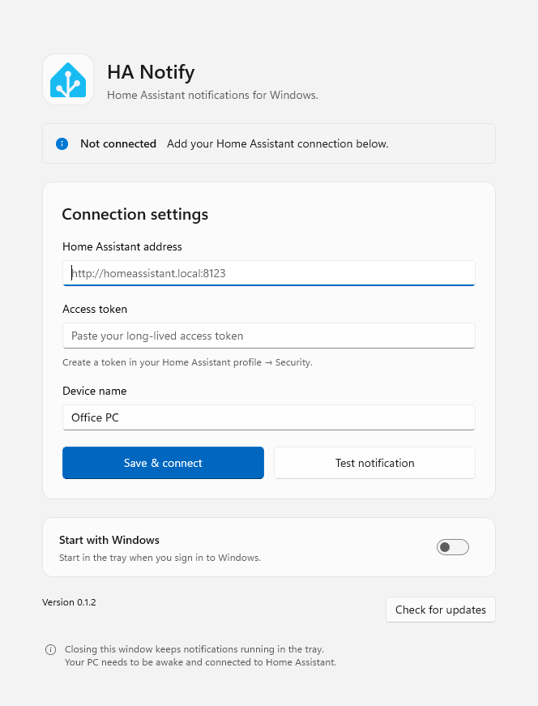
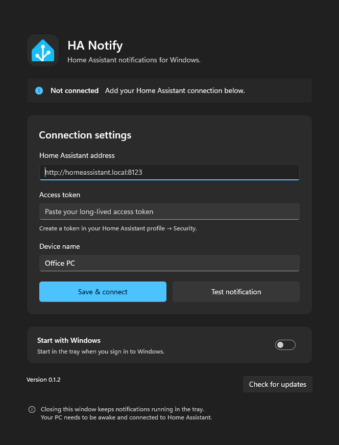
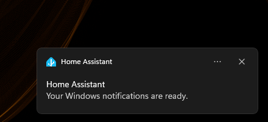

# HA Notify

Home Assistant notifications for Windows 11. Runs in the system tray and follows your Windows theme.

## Install

Download the EXE installer from [Releases](https://github.com/wrenchware/ha-notify/releases/latest). It includes the required runtimes and installs for your Windows account.

The installer shows the version change, closes HA Notify during an update, and reopens it afterward. Saved connection settings are preserved.

## Updates

HA Notify checks GitHub for updates at startup and every six hours. You can also select **Check for updates** in settings. Updates are downloaded only after you confirm the version change.

## Screenshots

| Light | Dark |
| --- | --- |
|  |  |



## Setup

1. Enter your Home Assistant address.
2. Create a long-lived access token in your Home Assistant profile under **Security**, then paste it into the app.
3. Enter a device name and click **Save & connect**.
4. Click **Test notification** to check Windows notifications. This button does not test the Home Assistant connection.

Home Assistant's `mobile_app` integration must be enabled. It is included in `default_config` and is normally present if you use the phone companion app.

## Send a notification

In Home Assistant, open **Developer Tools → Actions** and select your device's `notify.mobile_app_...` action. For a device named `Office PC`:

```yaml
action: notify.mobile_app_office_pc
data:
  title: "Laundry"
  message: "The washing machine is finished."
```

Use the same action in automations and scripts. If it is missing after setup, reload the Mobile App integration or restart Home Assistant.

## Notes

- Close the window to keep listening in the tray. Use the tray menu to exit.
- Enable **Start with Windows** to launch at sign-in. Keep the app folder at the same path afterward.
- Automatically reconnects if the connection is interrupted.
- The PC must be awake, the app running, and Home Assistant reachable. Missed notifications are not queued.
- Supports titles and text. Images and action buttons are not supported yet.
- Notifications appear as **Home Assistant** in Windows. Check Windows notification settings and Do Not Disturb if banners do not appear.
- Connection details are encrypted for your Windows account and stored in `%LOCALAPPDATA%\HaNotify\connection.dat`. Use HTTPS for remote connections.
- Changing the server or device name creates a new HA registration. Remove unused devices from the Mobile App integration.

## Build from source

Requires Windows 11 (x64) and the .NET 10 SDK. From the repository folder:

```powershell
dotnet publish .\HaNotify\HaNotify.csproj -c Release -o .\dist --self-contained true
.\dist\HaNotify.exe
```

Keep the entire `dist` folder together. Run the app as a normal user, not as administrator.

## Development

Built with C# and WinUI 3. Run the connection tests with:

```powershell
dotnet run --project .\tests\ProtocolChecks.csproj -c Release
```

`HaNotify.exe --preview` saves light, dark, and narrow-window previews without connecting to Home Assistant.

Build the EXE installer with Inno Setup 6 installed:

```powershell
.\tools\Build-Installer.ps1
```

Logo from the [Home Assistant asset pack](HaNotify/Assets/README.md).
